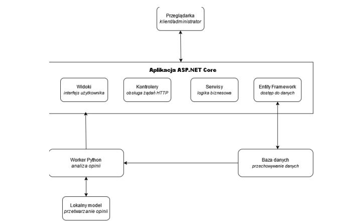
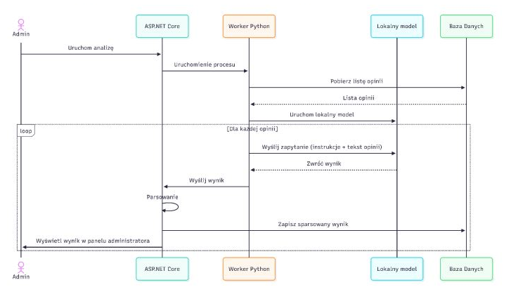

# Sklep internetowy z inteligentnym przetwarzaniem opinii

Platforma e-commerce z wbudowanym modułem inteligentnej analizy opinii klientów. 
System umożliwia klientowi przeglądanie i zamawianie produktów, dodawanie ich do koszyka, oraz wystawianie opinii pod produktami, lub w panelu opinii o sklepie.

Administrator posiada dedykowany panel transakcji, funkcjonalności zarządzania stanem magazynowym oraz dashboard analityczny, w którym może uruchomić analizę opinii klientów przy użyciu lokalnego modelu językowego.

Wyniki prezentowane są administratorowi na bieżąco w trakcie trwania analizy.

---

# Użyte Technologie

| Technologia | Zastosowanie |
|---|---|
| C# / ASP.NET Core MVC | Framework aplikacji webowej, architektura MVC z warstwą serwisową |
| Entity Framework Core | ORM, obsługa bazy danych i relacji między encjami |
| BCrypt.Net | Hashowanie haseł |
| Microsoft SQL Server | Relacyjna baza danych systemu |
| Python | Worker analityczny — komunikacja z modelem językowym |
| pyodbc | Połączenie workera z bazą danych |
| Bielik 4.5B Q8 | Lokalny model językowy do analizy opinii |
| Docker | Konteneryzacja aplikacji |


# Architektura i diagramy systemu

## Ogólna architektura i przepływ danych

Diagram przedstawia zarys ogólnej architektury systemu wraz z przepływem danych pomiędzy poszczególnymi modułami



---

### Diagram sekwencji: Proces analizy opinii

Szczegółowy przebieg procesu analizy opinii klientów




# Instrukcje uruchomienia

## 1. Uruchomienie lokalne platformy e-commerce

### Wymagania
- [.NET 8 SDK](https://dotnet.microsoft.com/download)
- Klient SQL, np. [SQL Server Management Studio](https://www.microsoft.com/en-us/download/details.aspx?id=42299)


### Kroki

1. Sklonuj repozytorium:
```bash
   git clone https://github.com/PawellosW/EstoreThesis.git
```

2. Podaj nazwę swojego serwera w pliku `appsettings.json`:
```json
   "ConnectionStrings": {
     "DefaultConnection": "Server=NAZWA_SERWERA;Database=store;Trusted_Connection=True;"
   }
```
3. Utwórz bazę danych:
   - Otwórz klienta SQL i połącz się ze swoim serwerem
   - Otwórz plik `init.sql` z głównego katalogu projektu
   - Wykonaj **osobno** pierwsze dwie linie (`CREATE DATABASE store; GO`),
     następnie zaznacz i wykonaj resztę skryptu


4. Uruchom aplikację. Otwórz konsolę tam gdzie plik .csproj i wpisz (uruchomi się w przeglądarce):
```bash
   dotnet run
```

---


## 2. Uruchomienie lokalne modułu analitycznego

Moduł analityczny wymaga lokalnego modelu językowego Bielik 4.5B (lub pokrewny) i uruchamiany jest w momencie kliknięcia przez administratora przycisku „Uruchom analizę" w dashboardzie analitycznym.

### Wymagania
- Model Bielik w formacie GGUF (zalecany: Bielik-4.5B-v3.0-Instruct.Q8_0.gguf)
  Można użyć mocniejszego wariantu z tej samej rodziny modeli.
  [Pobierz z HuggingFace](https://huggingface.co/speakleash/Bielik-4.5B-v3.0-Instruct-GGUF/resolve/main/Bielik-4.5B-v3.0-Instruct.Q8_0.gguf)
- Python 3.10+ (https://www.python.org)
- Biblioteki Python: `llama-cpp-python`, `pyodbc`

### Kroki

1. Zainstaluj biblioteki Python:
```bash
   cd AnalysisModule
   pip install llama-cpp-python pyodbc
```

2. Ustaw ścieżkę do modelu w pliku `master_worker.py`:
```python
   MODEL_PATH = "ścieżka/do/modelu/bielik.gguf"
```

3. Ustaw connection string do bazy w `master_worker.py`:
```python
   DB_CONFIG = (
       r"DRIVER={SQL Server};"
       r"SERVER=NAZWA_SERWERA;"
       r"DATABASE=store;"
       r"Trusted_Connection=yes;"
   )
```


## 3. Uruchomienie przez Docker

### Wymagania
- [Docker Desktop](https://www.docker.com/products/docker-desktop)
- Klient SQL, np. [SQL Server Management Studio](https://www.microsoft.com/en-us/download/details.aspx?id=42299)

### Kroki

1. Sklonuj repozytorium:
```bash
   git clone https://github.com/PawellosW/EstoreThesis.git
```

2. Utwórz plik `.env` w głównym katalogu (tam, gdzie znajduje się plik `compose.yaml`) i wklej tą zawartość, ustawiając własne hasło:
```
   DB_PASSWORD=TwojeMocneHaslo123
```

3. Uruchom kontenery:
```bash
   docker compose up --build
```

4. Zainicjalizuj bazę danych (tylko przy pierwszym uruchomieniu):
   - Połącz się klientem SQL do:
     - **Server:** `localhost,1433`
     - **Authentication:** SQL Server Authentication
     - **Login:** `sa`
     - **Password:** hasło ustawione w kroku 2
   - Otwórz z pozycji klienta SQL plik `init.sql` znajdujący się w katalogu projektu (tam gdzie `compose.yaml`)
   - Wykonaj **osobno** pierwsze dwie linie (`CREATE DATABASE store; GO`), a następnie zaznacz i wykonaj resztę skryptu, tworząc tabele

5. Aplikacja dostępna pod adresem: `http://localhost:8080`

---

